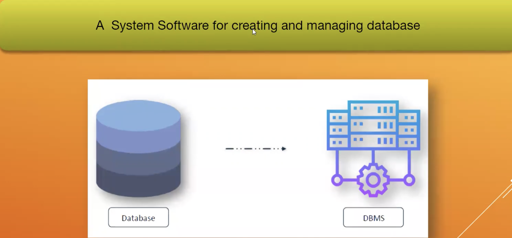

# SQL_For_Analytics

1. 1.	Data Query Language:
    a.	Select
2.	Data Definition Language
    a.	Create Table
    b.	Alter Table
    c.	Drop Table
3.	Data Manipulation Language
    a.	Insert
    b.	Update
    c.	Delete
4.	Data Control Language
    a.	Grant
    b.	Revoke

Data Type of SQL:
1.	There are three types of data
    a.	Numeric (Integer, 
    b.	Character
    c.	Date and Time

Primary Key:
    1.	Cannot be duplicate value
    2.	Cannot be null value

Foreign Key:
1.	Correspond to the values of the primary key in another table

